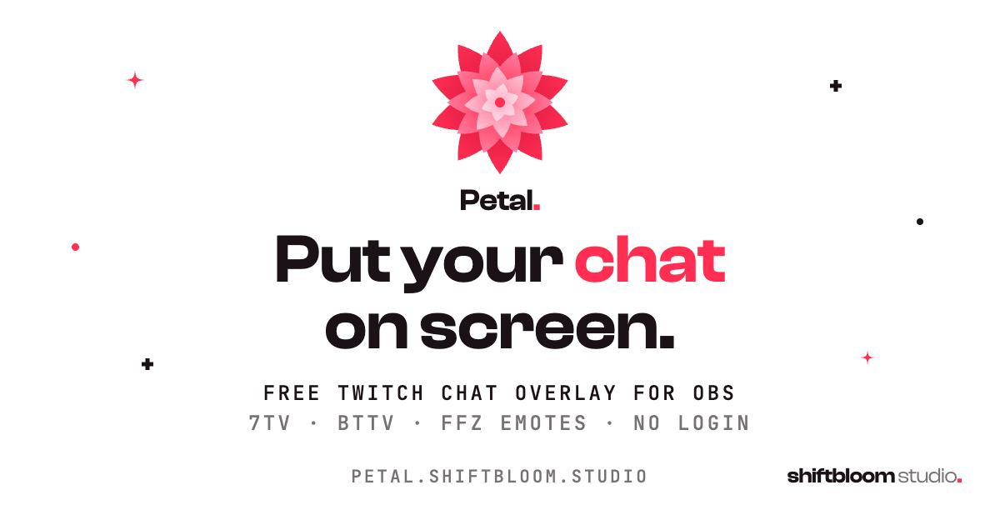

<p align="center">
  <a href="https://petal.shiftbloom.studio"></a>
</p>

<h1 align="center">Petal: Twitch chat overlay for OBS</h1>

<p align="center">
  <b>Put your Twitch chat on screen.</b><br>
  A free, open-source chat overlay with 7TV, BetterTTV (BTTV) and FrankerFaceZ (FFZ) emotes,
  badges and name paints.<br>
  No account. No login. Nothing to install.
</p>

<p align="center">
  <a href="https://petal.shiftbloom.studio"><b>Make your overlay link</b></a>
  &nbsp;·&nbsp; <a href="#get-started">Get started</a>
  &nbsp;·&nbsp; <a href="#overlay-options">Options</a>
  &nbsp;·&nbsp; <a href="#faq">FAQ</a>
  &nbsp;·&nbsp; <a href="#run-it-yourself">Run it yourself</a>
  &nbsp;·&nbsp; <a href="docs">Docs</a>
</p>

<p align="center">
  <a href="https://github.com/shiftbloom-studio/petal/actions/workflows/ci.yml"></a>
  <a href="LICENSE"></a>
</p>

Petal turns your Twitch chat into a transparent browser source for OBS. Type your channel, copy
the link, and your chat is on screen, with every emote, badge and name paint your viewers expect
to see.

## Why Petal

- **Three steps, no account.** Enter your channel, copy the link, add a browser source. Petal
  never asks for a Twitch login, a token or any permission on your account.
- **Your look.** Text size, font, outline, shadow, emote size and what chat shows: choose it on
  the start page and watch the preview follow. The link carries the look, so there is nothing to
  save.
- **Every emote.** Twitch, 7TV, BTTV and FFZ: global, channel and personal sets, zero-width
  emotes and emote modifiers. Emotes added or removed mid-stream show up without a reload.
- **Badges and name paints.** Badges from Twitch, 7TV, BTTV, FFZ, FFZ:AP and Chatterino, and
  Chatterino Homies badges if you switch them on. 7TV name paints and BTTV username effects.
- **Made for live.** Subscription notices, `/me` actions and Shared Chat messages are shown, and
  messages that moderators remove disappear from the overlay. Every connection reconnects on its
  own, so the source can stay in your scene for the whole stream.
- **Private by design.** Chat is read anonymously and read-only. It passes through Petal in
  memory only and is never stored or logged. No cookies, no ads, no analytics of visitors. The
  only thing kept in your browser is your light or dark choice on the start page.
- **Free and open source.** AGPL-3.0-or-later, made and hosted by
  [shiftbloom studio](https://shiftbloom.studio), an open digital studio in Hamburg.

|                    | Twitch | 7TV    | BTTV    | FFZ | FFZ:AP | Chatterino | Chatterino Homies |
| ------------------ | :----: | :----: | :-----: | :-: | :----: | :--------: | :---------------: |
| Emotes             | ✓      | ✓      | ✓       | ✓   |        |            |                   |
| Badges             | ✓      | ✓      | ✓       | ✓   | ✓      | ✓          | optional          |
| Name styling       |        | paints | effects |     |        |            |                   |

## Get started

1. **Enter your channel.** Open [petal.shiftbloom.studio](https://petal.shiftbloom.studio) and type
   your Twitch channel into the field. A bare name, `@name` or a twitch.tv link all work.
2. **Copy the overlay link.** Press "Copy overlay URL". There is nothing to create and nothing to
   install. If you want another look than the default, choose it below the channel field first:
   the preview shows every change with sample messages, and the link follows.
3. **Add it to OBS.** In OBS, add a **Browser** source and paste the link as its URL. Size the
   source to the part of the scene where chat should sit. The page is transparent, and new
   messages stack up from its bottom edge. No custom CSS is needed.

Your link looks like this, with your own channel at the end, followed by the options that differ
from the default:

```text
https://petal.shiftbloom.studio/chat/yourchannel
```

Petal needs OBS 31 or newer. OBS 31 embeds Chromium 127; OBS 30 and older embed an older Chromium
that the build does not target, so emote animations stand still there and other things may fail.

Overlay links live in OBS scenes, so Petal keeps them working.

## Overlay options

The start page writes the look into the link, as parameters behind the channel. Only values that
differ from the default appear, always in the order of this table, so a link without parameters
shows the default look. Unknown and invalid values fall back to the default.

| Parameter  | Values                                         | Default  | Effect                                                     |
| ---------- | ---------------------------------------------- | -------- | ---------------------------------------------------------- |
| `size`     | `1`, `2`, `3`                                  | `1`      | Text size: small, medium, large                            |
| `font`     | `system`, `sans`, `display`, `mono`, `serif`, `alsina` | `system` | Font, served by Petal itself or a system font stack |
| `stroke`   | `0` to `3`                                     | `0`      | Text outline: off, thin, medium, thick                     |
| `shadow`   | `0` to `3`                                     | `1`      | Text shadow: off, small, medium, large                     |
| `emotes`   | `1`, `2`, `3`                                  | `1`      | Emote size relative to the text: normal, large, huge       |
| `animate`  | `1`, `0`                                       | `1`      | New lines slide in                                         |
| `fade`     | `0` to `600`                                   | `0`      | Seconds until a line fades out; `0` keeps it               |
| `badges`   | `1`, `0`                                       | `1`      | Show badges                                                |
| `bots`     | `1`, `0`                                       | `1`      | Show messages of well-known bots                           |
| `commands` | `1`, `0`                                       | `1`      | Show messages that start with `!`                          |
| `caps`     | `1`, `0`                                       | `0`      | Small caps                                                 |
| `ignore`   | Up to 20 logins, separated by commas           | none     | Hide the messages of these accounts                        |
| `custom`   | A font name of up to 40 characters: letters, digits, space, hyphen, underscore, dot | none | A font installed on the computer that shows the overlay. It comes before `font`, which stays the fallback. Nothing is downloaded for it |
| `nl`       | `1`, `0`                                       | `0`      | The message starts on a new line below the name            |
| `names`    | `1`, `0`                                       | `1`      | Show user names                                            |
| `homies`   | `1`, `0`                                       | `0`      | Show Chatterino Homies badges. The only option that makes the overlay contact further hosts, see [How it works](#how-it-works) |

Two more parameters are not part of the look. `demo=1` shows sample messages instead of a
channel's chat and connects to nothing; the preview on the start page uses it. `direct=1` makes
the overlay connect to Twitch and the emote services itself instead of using Petal's relay and
cache.

## How it works

- **Chat** arrives through Petal's own relay. It reads the channel from Twitch over an anonymous,
  read-only connection and passes every line on to the overlays of that channel. It keeps the
  last 50 lines per channel in memory, so an overlay that joins late or reloads does not start
  empty. Chat is neither stored nor logged nor analysed.
- **Lists of emotes, badges and name paints** of 7TV, BTTV, FFZ, FFZ:AP, Chatterino and IVR
  arrive through Petal's data gateway, which fetches them from the services and caches them. The
  services do not see your IP address for these requests.
- **Images and live updates** are loaded by the browser from the services themselves.
- **Chatterino Homies badges** are off by default. With `homies=1` the browser loads their lists
  and images from `chatterinohomies.com`, `cdn.chatterinohomies.com` and `itzalex.github.io`.
- **Fallback.** If the relay or the gateway cannot be reached, the overlay connects to Twitch and
  the services directly, without a reload. `direct=1` in the link forces this.

The relay, the gateway, their limits and what is held where are described in
[docs/ARCHITECTURE.md](docs/ARCHITECTURE.md).

## FAQ

**Is Petal free?**
Yes. It costs nothing, shows no ads and needs no account. The source code is public under the
GNU Affero General Public License, version 3 or later.

**Do I have to log in with Twitch?**
No. Petal reads chat anonymously and read-only. It never asks for your Twitch login, a token or
any permission on your account.

**Does it work with Streamlabs and other streaming software?**
Petal is a web page, so it works in any streaming software that has a browser source, such as OBS
Studio and Streamlabs Desktop. To check a link, open it in a normal browser tab.

**What happens when a connection drops during a stream?**
The overlay reconnects on its own. Every connection it holds, to the chat and to the emote
services, is re-established without a reload. If Petal's relay cannot be reached, the overlay
reads the chat from Twitch itself.

**Can I change the size, font or colors?**
Size and font, yes, and also the outline, the shadow, the size of emotes and what chat shows:
see [Overlay options](#overlay-options). There is no option for colors.

**Does Petal track me or my viewers?**
No. Petal has no accounts, sets no cookies and runs no analytics of visitors or advertising. Chat
passes through Petal's relay in memory and is neither stored nor logged. See the
[privacy policy](https://petal.shiftbloom.studio/privacy).

**Is Petal a replacement for ChatIS?**
Petal is a fork of [ChatIS](https://github.com/IS2511/ChatIS) by IS2511, rebuilt and hosted by
shiftbloom studio. If you used ChatIS, make a new overlay link on the start page and swap it into
your browser source. Links made with ChatIS do not carry over.

The start page answers more of these, and
[petal.shiftbloom.studio/llms-full.txt](https://petal.shiftbloom.studio/llms-full.txt) has all of
it as Markdown.

## Run it yourself

You need Node.js 24 or newer and [pnpm](https://pnpm.io), at the version pinned in
`package.json`.

```bash
git clone https://github.com/shiftbloom-studio/petal.git
cd petal
pnpm install
pnpm dev
```

The dev server prints its address. Open `/` for the start page, or `/chat/<channel>` for the
overlay of a channel. The relay and the gateway only exist on Cloudflare, so an overlay in
development connects to Twitch and the emote services directly. The first run downloads two free
fonts from Fontshare; without a connection, the pages fall back to system fonts. Run `pnpm check`
(types, lint, tests) before you push.

Petal runs on Cloudflare Workers, with Durable Objects and Workers KV. To host your own copy, see
[docs/DEPLOYMENT.md](docs/DEPLOYMENT.md).

## Documentation

| Page                                     | What is in it                                                        |
| ---------------------------------------- | -------------------------------------------------------------------- |
| [Architecture](docs/ARCHITECTURE.md)     | How chat reaches the overlay, the relay and the gateway, the services it talks to, the code layout |
| [Contributing](docs/CONTRIBUTING.md)     | Development workflow, tests and the rules for changes                |
| [Deployment](docs/DEPLOYMENT.md)         | Hosting on Cloudflare: setup, costs and operations                   |
| [Search and language models](docs/SEO.md) | How the start page is written for search engines and AI assistants  |

## License and credits

Petal is licensed under the [GNU Affero General Public License v3.0 or later](LICENSE). If you
run a modified version as a network service, the AGPL requires you to offer its source code to
its users.

- Started from [ChatIS](https://github.com/IS2511/ChatIS) by IS2511.
- [Clash Display and General Sans](https://www.fontshare.com) by the Indian Type Foundry, under
  the ITF Free Font License. They are downloaded at build time and not part of this repository.
- [JetBrains Mono](https://www.jetbrains.com/lp/mono/) under the SIL Open Font License, in
  `public/fonts/jetbrains-mono/`.
- Petal is not affiliated with or endorsed by Twitch, 7TV, BetterTTV, FrankerFaceZ, Chatterino or
  Chatterino Homies.

Made by [shiftbloom studio](https://shiftbloom.studio) in Hamburg.
[Imprint](https://petal.shiftbloom.studio/imprint) ·
[Privacy](https://petal.shiftbloom.studio/privacy)
