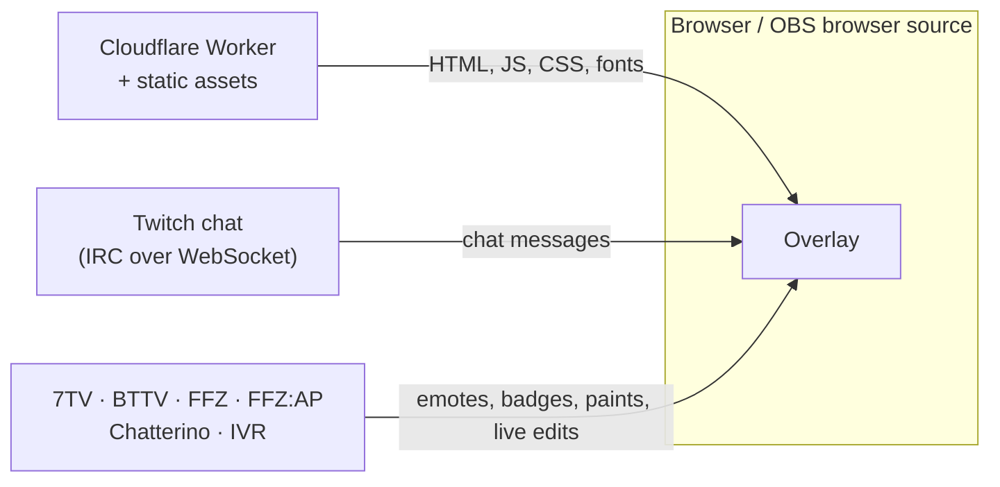

<p align="center">
  
</p>

<h1 align="center">Petal</h1>

<p align="center">
  A Twitch chat overlay for streamers. Paste your channel, get a URL, add it to OBS.<br>
  Emotes, badges and name paints from Twitch, 7TV, BetterTTV and FrankerFaceZ, live.
</p>

<p align="center">
  <a href="https://github.com/shiftbloom-studio/ChatBloom/actions/workflows/ci.yml"></a>
  
  
</p>

> **A note on names.** The product is called Petal. The repository, the Cloudflare Worker
> (`chatbloom`) and some strings inside the app still use the earlier name ChatBloom. The Worker
> name stays: renaming a Worker creates a new one and drops its domains.

Petal is a fork of [ChatIS](https://github.com/IS2511/ChatIS) by IS2511, rebuilt on SolidStart 2
and hosted on Cloudflare by [shiftbloom studio](https://shiftbloom.studio). It is free software
under the AGPL.

## Use it

1. Open the start page (`/v3` on the deployment, currently <https://chat.shiftbloom.studio/v3>) and
   type your Twitch channel. A bare name, `@name`, `#name` or a `twitch.tv/name` link all work.
2. Copy the overlay URL. It looks like `https://chat.shiftbloom.studio/v3/chat/<channel>`.
3. In OBS, add a **Browser** source, paste the URL and size the source to the part of the scene
   where chat should sit. The page is transparent and fills the whole source; messages stack up
   from the bottom edge. No custom CSS is needed.

Overlay URLs live in streamers' OBS scenes, so an overlay path is never removed once it has
shipped.

The start page follows your device's light or dark setting. The button in the header cycles
between the device setting, light and dark. The overlay is never themed: it stays transparent and
exactly as authored, whichever theme you pick.

### What the overlay shows

| Area             | Details                                                                                                                   |
| ---------------- | ------------------------------------------------------------------------------------------------------------------------- |
| Chat             | Anonymous, read-only Twitch chat. No login, no token. Keeps the last 100 messages. `/me` actions, subscription and other system notices, and Shared Chat messages (with the source channel's emotes and badges) are supported. Bans, timeouts and deleted messages remove the messages on screen. |
| Emotes           | Twitch, 7TV, BTTV and FFZ: global, channel and personal sets, updated live while the stream runs. Zero-width emotes stack, and BTTV (`w!`, `h!`, `v!`, `c!`, ...) and FFZ modifiers are rendered as CSS effects. |
| Badges           | Twitch, 7TV, BTTV, FFZ (including its custom moderator, VIP and bot badges), FFZ:AP and Chatterino.                        |
| Name paints      | 7TV paints with all their layers, and BTTV username effects.                                                              |
| Resilience       | Every connection reconnects with jittered exponential backoff. The Twitch and 7TV connections are also replaced when they go quiet. |

### Who can open an overlay

Browsers and browser-based streaming tools such as OBS open an overlay without any setup.
Crawlers, search engines, AI scrapers and command-line clients get a `403` on chat pages, and
`public/robots.txt` allows only the start page to be indexed. See
[Bot protection](#bot-protection) for how this works and what it cannot catch.

### Current limits

- The look is fixed. There are no URL parameters for size, font or colors, and no option to hide
  bot accounts or commands in chat.
- Chat is read directly from the browser. There is no server-side chat relay, so each overlay
  opens its own connections to Twitch and to the emote providers.

## How it works



The Worker only serves the app. It has no state, no secrets and no part in the chat traffic, apart
from turning crawlers and scripts away from chat pages. An open overlay costs one Worker request
when it loads and nothing while it runs.

Everything a running overlay talks to:

| Service               | Hosts                                                                | Used for                                 |
| --------------------- | -------------------------------------------------------------------- | ---------------------------------------- |
| Twitch                | `irc-ws.chat.twitch.tv`, `static-cdn.jtvnw.net`                      | Chat, emote and badge images             |
| IVR                   | `api.ivr.fi`                                                         | Twitch badge sets                        |
| 7TV                   | `7tv.io`, `events.7tv.io`                                            | Emotes, paints, badges, live updates     |
| BetterTTV             | `api.betterttv.net`, `cdn.betterttv.net`, `sockets.betterttv.net`    | Emotes, badges, username effects         |
| FrankerFaceZ          | `api.frankerfacez.com`, `pubsub.workers.frankerfacez.com`            | Emotes, badges, live updates             |
| FFZ:AP, Chatterino    | `api.ffzap.com`, `api.chatterino.com`                                | Badges                                   |

Emote images also load from the CDNs those APIs point to. Petal is not affiliated with or
endorsed by Twitch, 7TV, BetterTTV, FrankerFaceZ or Chatterino.

### Inside the overlay

`src/lib/chat/session.ts` is the core. `createChatSession(channel)` opens the Twitch connection
and every provider socket, and exposes reactive state to the Solid components:

- `irc/` parses Twitch IRC (`parse.ts`) and runs the anonymous `justinfan` connection (`client.ts`).
- `providers/` has one module per service: REST loaders, and the live sockets for 7TV
  (EventAPI), BTTV and FFZ (pubsub).
- `tokenize.ts` turns a message into text, mention and emote parts, and `effects.ts` reduces
  emote modifiers to CSS.
- `socket.ts` is the shared `ReconnectingSocket` behind every connection.

Provider data arrives at any time, often after the user's first message, so messages are
re-derived when an emote set, badge or cosmetic changes instead of being frozen at arrival.

### Night mode

The site is authored in white, and its night version is generated from the same tokens by
[Dark Reader](https://darkreader.org), never restyled by hand. Two layers work together:

- **Native.** `color-scheme` darkens scrollbars and form controls, and `theme-color` follows the
  page in the browser's address bar. A small script in `<head>` (`bootScript` in
  `src/lib/theme/mode.ts`) picks the theme before the first paint and holds the page back until
  Dark Reader has painted, so a dark visitor never sees a white flash.
- **Generated.** `src/lib/theme/controller.ts` loads Dark Reader as a browser-only chunk, so
  visitors in light mode never download it. It steps aside, and the toggle disappears, when the
  Dark Reader browser extension already themes the page. If the chunk fails to load, the page
  stays light instead of staying hidden.

The choice made with the header toggle is kept in the browser's local storage under `theme`, and
only after a visitor uses the toggle. Without scripts the page stays light. Overlay paths
(`/chat/` and `/v3/chat/`, matched case-insensitively) are exempt.

### Bot protection

Only the start page is meant for bots. A chat page shows the messages of a channel, so it is not
for crawlers or scripts.

- `public/robots.txt` allows the start page and disallows everything else.
- `src/server/block-bots.ts` runs for every request. On chat pages it sets
  `x-robots-tag: noindex, nofollow, noarchive` and answers `403` to a request without a
  `User-Agent`, or with one that names a crawler, an AI scraper, an HTTP library or a command-line
  tool (`src/server/bots.ts`). Paths are decoded and compared case-insensitively, the way the
  router reads them, so `/V3/CHAT/x` and `/v3/%63hat/x` are caught too.
- The check never issues a challenge: OBS cannot answer a challenge page, and a false positive
  would blank a streamer's overlay mid-stream.
- It goes by what a program says about itself, so a script that sends a browser's user agent gets
  through. The WAF rule and rate limit in
  [docs/DEPLOYMENT.md](docs/DEPLOYMENT.md#7-block-bots-on-the-chat-routes) cover that, and stop
  requests before a Worker request is billed.

## Project layout

```text
src/
  routes/
    v3/index.tsx            Start page: channel field, feature overview
    v3/chat/[channel].tsx   The overlay
    imprint, impressum, privacy, datenschutz    Legal pages, English and German
  components/
    chat/                   Overlay: lines, emotes, usernames, name paints
    brand/                  Bloom mark, wordmark, sprinkles
    legal/                  Legal page layout and the operator's details
    ThemeToggle.tsx         Header button for light, dark or the device setting
  lib/
    channel.ts              Reads a channel from whatever people paste
    chat/                   Chat session, IRC, tokenizer, effects, providers
    theme/                  Night mode: shared rules and the controller around Dark Reader
  server/
    bots.ts, block-bots.ts  Bot check and the middleware that applies it to chat pages
    collapse-slashes.ts     Redirects paths with doubled slashes
    uncached-errors.ts      Keeps error responses out of caches
public/robots.txt           Only the start page may be indexed
scripts/fontshare.ts        Downloads the Fontshare fonts before dev and build
test/                       Unit tests (Node's test runner)
docs/DEPLOYMENT.md          Hosting, setup, costs and operations
```

| Layer      | Technology                                                                              |
| ---------- | --------------------------------------------------------------------------------------- |
| Framework  | [SolidStart](https://docs.solidjs.com/solid-start) 2 with Solid, Vite 8 and Nitro 3      |
| UI         | [SUID](https://suid.dev) (Material UI for Solid), patched for `@suid/styled-engine`      |
| Night mode | [Dark Reader](https://github.com/darkreader/darkreader), generated from the light styles |
| Language   | TypeScript 7                                                                            |
| Quality    | Biome for linting and formatting, `node --test` for tests                               |
| Hosting    | Cloudflare Workers with static assets, built and deployed by Cloudflare from this repo  |

## Development

Requirements: Node.js 24 or newer (`.node-version`) and pnpm, at the version pinned in
`package.json` under `packageManager`.

```bash
pnpm install
pnpm dev
```

The dev server runs on plain Node and prints its URL. Open `/v3` for the start page or
`/v3/chat/<channel>` for the overlay. No Cloudflare tooling is needed or installed.

The first `pnpm dev` or `pnpm build` downloads Clash Display and General Sans from Fontshare into
`public/fonts/fontshare/`. The folder is git-ignored because the fonts' license does not allow
republishing them. If the download fails, the pages fall back to system fonts.

| Script           | What it does                                          |
| ---------------- | ----------------------------------------------------- |
| `pnpm dev`       | Start the dev server with HMR                         |
| `pnpm build`     | Production build for Cloudflare Workers, in `.output/` |
| `pnpm typecheck` | Type-check with TypeScript                            |
| `pnpm lint`      | Lint and check formatting with Biome                  |
| `pnpm format`    | Apply Biome formatting and safe fixes                 |
| `pnpm test`      | Run the unit tests in `test/`                         |
| `pnpm check`     | `typecheck`, `lint` and `test`: run before pushing    |

There is no local preview of the built Worker. Use the dev server while working, and a branch
preview build from Cloudflare to try the real deployment.

### Tests

The tests cover IRC parsing, message tokenizing and emote modifiers, every provider's parsers,
7TV events and paints, the reconnecting sockets, the theme rules (including the pre-paint boot
script), and the bot check (which user agents pass, and which spellings of a chat path it
recognizes). They run offline: WebSockets are replaced by a fake
(`FakeWebSocket`) and `fetch` answers from a table (`stubFetch`), both in `test/helpers.ts`.

When the bot check learns a new pattern, add the user agent to `test/bots.test.ts`, and add a
browser or streaming tool's user agent there too if a change could block one. A false positive
blanks an overlay.

### Contributing

- Run `pnpm check` before pushing. CI additionally runs `biome ci` and a production build.
- Code style is set by Biome: four spaces, 100 columns. Commit messages follow
  `type(scope): summary` (`feat`, `fix`, `chore`, `test`).
- **Adding a service, a third-party host or anything stored in the browser changes the privacy
  policy.** Update `src/routes/privacy.tsx` and `src/routes/datenschutz.tsx` in the same change,
  together with the list in [docs/DEPLOYMENT.md](docs/DEPLOYMENT.md#legal-pages).
- Keep fonts, scripts and images self-hosted. The pages set no cookies and run no analytics. The
  only thing stored in the browser is the theme choice.
- Do not write dark styles by hand. Change the light tokens in `src/brand.css`; Dark Reader
  derives the night version from them.

## Deployment

Petal runs entirely on Cloudflare. Nothing is self-hosted. Cloudflare builds and deploys the app
from this repository on every push to `main`:

- Build command: `pnpm build`
- Deploy command: `npx wrangler@4 deploy`

Static files and the prerendered pages (`/v3` and the legal pages) are served by Cloudflare's
asset layer. The Worker renders the overlay pages and answers everything else.

Responses carry a security policy set in `vite.config.ts`: framing is refused by default, and
only the overlay pages stay embeddable, because streaming tools other than OBS load them in
frames. Chat pages also refuse crawlers and scripts (see [Bot protection](#bot-protection)); the
matching WAF rule is a one-time setup step on the Cloudflare zone.

Setup, costs, the settings that change the cost model, and troubleshooting are in
[docs/DEPLOYMENT.md](docs/DEPLOYMENT.md).

## CI

`.github/workflows/ci.yml` installs dependencies with the frozen lockfile, then runs typecheck,
`biome ci`, the tests and a build. It runs for pushes and pull requests to `main` on our
self-hosted runners. Pull requests from forks are skipped, because the runners are ours and this
repository is public. Renovate keeps dependencies current.

## Legal

`/imprint` and `/privacy`, with the German versions `/impressum` and `/datenschutz`, are linked
from every page.

## License and credits

Petal is licensed under the [GNU Affero General Public License v3.0 or later](LICENSE). If you
run a modified version as a network service, the AGPL requires you to offer its source code to
its users.

- Started from [ChatIS](https://github.com/IS2511/ChatIS) by IS2511.
- [Clash Display and General Sans](https://www.fontshare.com) by the Indian Type Foundry, under
  the ITF Free Font License. They are downloaded at build time and not part of this repository.
- [JetBrains Mono](https://www.jetbrains.com/lp/mono/) under the SIL Open Font License, in
  `public/fonts/jetbrains-mono/`.
