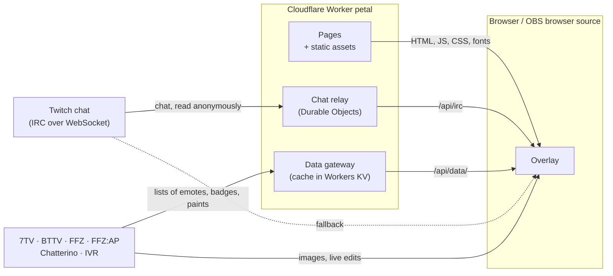

# Architecture

How Petal is built: how chat reaches a running overlay, what the overlay talks to, how the code is
organized, and the two features around it that need a word of explanation, night mode and bot
protection. For hosting and costs, see [DEPLOYMENT.md](DEPLOYMENT.md). To work on the code, see
[CONTRIBUTING.md](CONTRIBUTING.md).

## Names

The product is called Petal, and so are the repository and the Cloudflare Worker, `petal`. The name
is part of what the deployment and running overlays depend on: the KV namespace `petal-cache`, the
Analytics Engine dataset `petal_relay`, the keep-alive `PING :petal`, the response header
`x-petal-cache` and the IRC tag `petal-replay`. The Worker name stays: renaming a Worker creates a
new one and drops its domains.

## How it works



Petal is one Cloudflare Worker. It serves the pages, relays Twitch chat to the overlays through
Durable Objects, and answers the overlays' requests for emote, badge and paint data from a cache. No
accounts or secrets are involved.

- **Chat** arrives through Petal's own relay (`/api/irc`). A Durable Object, the hub, reads the
  channel from Twitch over an anonymous, read-only connection and passes every line on to the
  overlays of that channel. It keeps the last 50 lines per channel in memory, so an overlay that
  joins late or reloads does not start empty. Chat is neither stored nor logged nor analysed. See
  [The hub](#the-hub).
- **Lists of emotes, badges and name paints** of 7TV, BetterTTV, FrankerFaceZ, FFZ:AP, Chatterino
  and IVR arrive through Petal's data gateway (`/api/data/`), which fetches them from the providers
  and caches them in Workers KV. The providers do not see the visitor's IP address for these
  requests. See [The gateway](#the-gateway).
- **Images and live updates** are loaded by the browser from the providers.
- **Fallback.** If the relay or the gateway cannot be reached, the overlay connects to Twitch and
  the providers directly, as it does under `pnpm dev`. `?direct=1` on the overlay URL forces this.
  See [The client fallback](#the-client-fallback).

Everything behind a running overlay besides Petal itself:

| Service            | Asked by the Worker; by the browser only in the fallback | Asked by the browser         | Used for                             |
| ------------------ | --------------------------------------------- | --------------------------------------- | ------------------------------------ |
| Twitch             | `irc-ws.chat.twitch.tv`                       | `static-cdn.jtvnw.net`                  | Chat, emote and badge images         |
| IVR                | `api.ivr.fi`                                  |                                         | Twitch badge sets                    |
| 7TV                | `7tv.io`                                      | `events.7tv.io`                         | Emotes, paints, badges, live updates |
| BetterTTV          | `api.betterttv.net`                           | `cdn.betterttv.net`, `sockets.betterttv.net` | Emotes, badges, username effects |
| FrankerFaceZ       | `api.frankerfacez.com`                        | `pubsub.workers.frankerfacez.com`       | Emotes, badges, live updates         |
| FFZ:AP             | `api.ffzap.com`                               | `api.ffzap.com` (images)                | Badges                               |
| Chatterino         | `api.chatterino.com`                          |                                         | Badges                               |
| Chatterino Homies  |                                               | `chatterinohomies.com`, `cdn.chatterinohomies.com`, `itzalex.github.io`, and only with `homies=1` | Badges |

Emote and badge images also load from the CDNs those APIs point to, always by the browser.

### Inside the overlay

`src/lib/chat/session.ts` is the core. `createChatSession(channel)` opens the chat connection and
every provider socket, and exposes reactive state to the Solid components:

- `irc/` parses Twitch IRC (`parse.ts`) and runs the anonymous `justinfan` connection (`client.ts`),
  which speaks to the relay and to Twitch alike.
- `transport.ts` decides where the chat connection goes, relay first, and `gateway.ts` does the same
  for provider data. `platform.ts` tells both whether there is a relay to ask.
- `providers/` has one module per service: REST loaders, and the live sockets for 7TV (EventAPI),
  BTTV and FFZ (pubsub).
- `tokenize.ts` turns a message into text, mention and emote parts, and `effects.ts` reduces emote
  modifiers to CSS.
- `socket.ts` is the shared `ReconnectingSocket` behind every connection: jittered exponential
  backoff after a drop. The chat and 7TV connections are also replaced when they go quiet.
- `demo.ts` is the sample chat behind `demo=1`.

`src/lib/overlay/settings.ts` reads and writes the options of an overlay link, and
`src/components/chat/` applies them.

Provider data arrives at any time, often after the user's first message, so messages are re-derived
when an emote set, badge or cosmetic changes instead of being frozen at arrival. The overlay keeps
the last 100 messages. `CLEARCHAT` and `CLEARMSG` remove messages from the screen. A message from a
Shared Chat session is drawn with the emotes and badges of the channel it came from.

## Pages

| Path                                   | What it is                                                        |
| -------------------------------------- | ----------------------------------------------------------------- |
| `/`                                    | The start page, prerendered                                       |
| `/setup`                               | Redirects to `/#setup` (302): the setup is a section of the start page |
| `/chat/<channel>`                      | The overlay, rendered by the Worker                               |
| `/imprint`, `/impressum`, `/privacy`, `/datenschutz` | Legal pages, prerendered                            |
| anything else                          | The 404 page                                                      |

### The start page

There is one page for visitors, and it carries everything. Its hero ends in the channel field. The
section `#setup` below it holds the look options, the live preview and the personal link, which
reflects the channel and the look. The steps for OBS, the way from nothing to chat on screen in
short, the features and the questions follow.

`parseChannel` in `src/lib/channel.ts` reads the channel from whatever a streamer pastes, and is the
only implementation of that. `src/components/setup/` holds the options, the preview and the link;
the state behind them lives in `store.ts` and nowhere else, neither in the browser's storage nor on
a server. The preview is the overlay in a frame with `demo=1`, which shows sample messages from
`src/lib/chat/demo.ts` and opens no connection. Its badges and emotes are real ones, so the frame
loads their images from Twitch, 7TV and BetterTTV as any overlay page does; with `homies=1` a
shared Homies badge comes from itzalex.github.io. Once a channel is typed, the frame shows that
channel's own subscriber and bits badges: the demo resolves the login to an id (`ivr.user`) and
loads the channel's badge list (`ivr.badges.channel`), both through the gateway. The start page
itself loads nothing from a third-party host.

What the page says to search engines and language models is described in [SEO.md](SEO.md).

### Overlay options

The look and the filters travel in the query string of the overlay link.
`src/lib/overlay/settings.ts` holds the defaults, reads a link (`parseSettings`) and writes one
(`settingsQuery`, `overlayPath`); `src/components/chat/` applies the result. A link carries only
what differs from the default, in a fixed order, so the same settings always give the same link, and
a link without parameters shows the default look. Invalid values fall back to the default.

| Parameter  | Default  | Meaning                                                                 |
| ---------- | -------- | ----------------------------------------------------------------------- |
| `size`     | `1`      | Text size, `1` to `3`                                                   |
| `font`     | `system` | One of `system`, `sans`, `display`, `mono`, `serif`, `alsina`: fonts the site serves itself, and system font stacks |
| `stroke`   | `0`      | Text outline, `0` to `3`                                                |
| `shadow`   | `1`      | Text shadow, `0` to `3`                                                 |
| `emotes`   | `1`      | Emote size relative to the text, `1` to `3`                             |
| `animate`  | `1`      | New lines slide in                                                      |
| `fade`     | `0`      | Seconds until a line fades out, at most 600; `0` keeps it               |
| `badges`   | `1`      | Show badges                                                             |
| `bots`     | `1`      | Show messages of well-known bots and of accounts with Twitch's bot badge |
| `commands` | `1`      | Show messages that start with `!`                                       |
| `caps`     | `0`      | Small caps                                                              |
| `ignore`   | none     | Logins whose messages are hidden, at most 20                            |
| `custom`   | none     | Name of a font installed on the computer that shows the overlay; comes before `font`. Letters, digits, space, hyphen, underscore and dot, at most 40 characters; a name that breaks either rule is dropped whole |
| `nl`       | `0`      | The message starts on a new line below the name                         |
| `names`    | `1`      | Show user names                                                         |
| `homies`   | `0`      | Show Chatterino Homies badges                                           |

The filters run in the overlay. The relay passes on every line of the channel, whatever the link
says.

`homies` is the one option that reaches a third party. With `homies=1` and badges on,
`src/lib/chat/providers/homies.ts` loads three lists, from `chatterinohomies.com` and
`itzalex.github.io`, whole and without credentials, and accepts badge images from
`cdn.chatterinohomies.com` and `itzalex.github.io` only. The lists are not behind the gateway.
Without the parameter no request goes to any of these hosts.

Two more parameters are not part of the look. `demo=1` replaces the chat session by the sample chat,
and `direct=1` switches the relay and the gateway off for that overlay.

## Project layout

```text
src/
  app.tsx, entry-client.tsx, entry-server.tsx    App and the entries for browser and server
  theme.ts, brand.css, app.css    SUID theme, light tokens, font faces
  routes/
    index.tsx               Start page: channel field, look options, preview, overlay link,
                            setup steps, features, questions
    chat/[channel].tsx      The overlay
    imprint, impressum, privacy, datenschutz    Legal pages, English and German
    [...404].tsx            The 404 page
  components/
    chat/                   Overlay: lines, emotes, usernames, name paints
    brand/                  Bloom mark, wordmark, sprinkles
    legal/                  Legal page layout, the operator's details, the list of services
    seo/                    The start page's <head> and structured data
    setup/                  Look options, preview and overlay link on the start page
    start/                  Setup steps and questions on the start page
    icon/                   Logos of Twitch, 7TV, BetterTTV, FrankerFaceZ and Chatterino
    SetupHero.tsx, OverlayLink.tsx    Hero of the start page and its channel field
    FeaturesGrid.tsx, FeatureCard.tsx, SevenTVNamepaint.tsx    Features of the start page
    SiteHeader.tsx, SiteFooter.tsx    Header and footer of every page but the overlay
    MySiteTitle.tsx         The <title> of a page
    ThemeToggle.tsx         Header button for light, dark or the device setting
  lib/
    channel.ts              Reads a channel from whatever people paste
    chat/                   Chat session, IRC, transport and fallback, tokenizer, effects,
                            providers, demo chat
    overlay/                Options of an overlay link and the look they produce
    seo/                    What Petal says about itself, and the files built from it
    theme/                  Night mode: shared rules and the controller around Dark Reader
  server/
    bots.ts, block-bots.ts  Bot check and the middleware that applies it to chat pages
    collapse-slashes.ts     Redirects paths with doubled slashes
    uncached-errors.ts      Keeps error responses out of caches
  worker/
    entry.ts, api.ts        Entry of the Worker and the endpoints under /api/
    hub.ts, relay/          Chat relay: the Durable Object and its logic
    gateway/                Data gateway: allowlist, cache policy, 7TV paints
    rate-limit.ts, analytics.ts    Rate limit per client address, counters for Analytics Engine
    env.ts                  Bindings and variables of the Worker
public/robots.txt           Only the start page may be indexed
public/llms.txt, llms-full.txt, sitemap.xml    Written by scripts/seo.ts
public/fonts/               Self-hosted fonts; Fontshare's are downloaded here (git-ignored)
public/bloom.svg, favicon.ico, apple-touch-icon.png    Icons of the site
scripts/fontshare.ts        Downloads the Fontshare fonts before dev and build
scripts/seo.ts              Writes the files for search engines and language models
scripts/og.html             Source of public/og.png and og-square.png, the images of a shared link
scripts/og.ts               Renders them with a Chromium browser
scripts/e2e/                End-to-end suite of the relay and the gateway, and a smoke test, run by hand
test/                       Unit tests (Node's test runner)
docs/                       This documentation
wrangler.jsonc              Worker: name, bindings, variables, rate limits, logging
vite.config.ts              Build: Nitro preset, prerendered routes, route rules, entry of the Worker
patches/                    Patch for @suid/styled-engine
.github/                    CI workflow and issue templates
```

| Layer      | Technology                                                                              |
| ---------- | --------------------------------------------------------------------------------------- |
| Framework  | [SolidStart](https://docs.solidjs.com/solid-start) 2 with Solid, Vite 8 and Nitro 3      |
| UI         | [SUID](https://suid.dev) (Material UI for Solid), patched for `@suid/styled-engine`      |
| Night mode | [Dark Reader](https://github.com/darkreader/darkreader), generated from the light styles |
| Language   | TypeScript 7                                                                            |
| Quality    | Biome for linting and formatting, `node --test` for tests                               |
| Hosting    | Cloudflare Workers with static assets, Durable Objects and Workers KV, built and deployed by Cloudflare from this repo |

## Request flow

Cloudflare answers a request for a file of the build itself, without starting the Worker: the
prerendered pages, the fonts, the images, `robots.txt` and the files for language models. Every
other request goes to `src/worker/entry.ts`, the entry of the Worker. It exports the Durable Object
class and looks at the path:

- A path that starts with `/api/` is answered by `src/worker/api.ts` and never reaches Nitro. The
  prefix is exact and case-sensitive.
- Everything else is passed to the Worker that Nitro builds, unchanged. There, the middleware
  `collapse-slashes.ts` redirects a path with a doubled slash to the path with single slashes (307),
  `block-bots.ts` handles the chat pages (see [Bot protection](#bot-protection)), the route rules in
  `vite.config.ts` add headers by path and the redirect from `/setup` (see
  [Security headers](#security-headers)), and `uncached-errors.ts` sets `cache-control: no-store` on
  every error response the Worker renders.

The relay cannot be a route of the application: Nitro rebuilds every response to add the headers of
the route rules, and the response of a WebSocket upgrade does not survive that.

| Endpoint                         | Method    | Answer                                               |
| -------------------------------- | --------- | ---------------------------------------------------- |
| `/api/irc?channel=<login>`       | GET with a WebSocket upgrade | The chat of one channel, in the form of Twitch IRC |
| `/api/data/<prefix>/<path>`      | GET; POST for 7TV paints | Provider data as JSON, with the header `x-petal-cache` |
| `/api/status`                    | GET       | Counts as JSON                                       |
| anything else under `/api/`      |           | 404                                                  |

Every answer of the API is JSON with `cache-control: no-store`, except the upgraded connection
itself. No code path may throw: an exception that escapes is turned into a 503, because Cloudflare's
own error page would tell an overlay nothing.

`pnpm dev` runs on plain Node, where there are no Durable Objects and no KV. The dev server answers
everything under `/api/` with 503 at once, so an overlay in development uses its direct connections.

### A chat connection

For `/api/irc` the Worker checks, in this order:

| Check                                          | Refusal                    |
| ---------------------------------------------- | -------------------------- |
| The user agent is not that of a crawler or a tool, and not missing | 403 `automated_client` |
| The method is GET                              | 405 `method_not_allowed`   |
| The request asks for a WebSocket upgrade       | 426 `upgrade_required`     |
| `RELAY_ENABLED` is not `false`, `0`, `off` or `no` | 503 `relay_disabled`   |
| The `Origin` header, if any, names the Worker's own host | 403 `foreign_origin` |
| `channel` matches `^[a-z0-9_]{1,25}$` after lowercasing | 400 `invalid_channel` |
| The client address is within 300 connections per minute | 429 `rate_limited`, with `retry-after: 60` |
| The hub answers within 5 seconds               | 503 `relay_unavailable`    |
| The hub has not paused itself                  | 503 `relay_paused`, with `retry-after`: the seconds that remain |
| The hub has room for the overlay and its channel | 503 `hub_full` or `channels_full`, with `retry-after: 30` |

For the last three checks the Worker passes the original request to the hub of the channel. It returns
the hub's answer, which carries the overlay's end of the connection. From there on the Worker is no
longer involved: the overlay talks to the hub.

## The hub

`ChatHub` in `src/worker/hub.ts` is a Durable Object. It owns what only the Workers runtime has: the
hibernatable connections, the alarm and the bindings. The logic lives in `src/worker/relay/` and
runs under the unit tests on plain Node: `core.ts` is the hub itself, `upstream.ts` the pool of
connections to Twitch, `replay.ts` the replay buffer.

### Shards

There are `RELAY_SHARDS` hubs, 4 by default and 64 at most, named `hub-0` to `hub-<n-1>`. A value
that is not a whole number from 1 to 64 counts as the default, so 100 gives 4, not 64. A channel
belongs to the hub with the number `FNV-1a(channel) mod RELAY_SHARDS`. The hash is computed over the
lowercase login and does not depend on the isolate or the deployment, so every overlay of a channel
arrives at the same hub, where the channel is joined once.

Several hubs exist to spread CPU load and the consequences of a failure, not because one hub could
not hold the connections. A hub is created in Western Europe (location hint `weur`) and stays there.

### Overlay connections

The hub accepts overlay connections as hibernatable WebSockets. Each carries a small attachment
(channel, nick, phase, time of acceptance) that survives when the hub leaves memory. The overlay's
keep-alive `PING :petal` is answered by the runtime with `:tmi.twitch.tv PONG tmi.twitch.tv :petal`
without waking any code.

Towards the overlay the hub speaks enough of Twitch IRC for the client to work with the relay and
with Twitch alike:

| Overlay sends                                  | Hub answers                                          |
| ---------------------------------------------- | ---------------------------------------------------- |
| `CAP REQ :twitch.tv/tags twitch.tv/commands`   | `CAP * ACK` with the same capabilities               |
| `NICK justinfan<digits>`                       | The welcome numerics 001 to 004, 375, 372, 376. Any other nick is replaced by an anonymous one |
| `JOIN #<channel>`                              | Once Twitch has confirmed the hub's own JOIN: one frame with the JOIN echo, the cached ROOMSTATE and the replay |
| `PING <text>` other than the keep-alive        | `PONG` with the same text                            |
| `PART`, `QUIT`                                 | The hub closes the connection with 1000              |

After the JOIN echo the overlay receives the lines of its channel as Twitch sent them, unmodified:
PRIVMSG, USERNOTICE, CLEARCHAT, CLEARMSG, ROOMSTATE and NOTICE. Everything else on the upstream
connection is protocol housekeeping and stays in the hub.

The JOIN echo, the room state and the replay travel in one frame, so no live line can slip in
between them.

When an overlay closes its connection, the hub answers the close itself. Without the answer the
overlay's side would stay half closed until the browser gives up.

The hub closes a connection that does not behave like an overlay:

| Close code | Reason                                                              |
| ---------- | ------------------------------------------------------------------- |
| 1000       | The overlay sent PART or QUIT                                       |
| 1001       | Nothing was heard of the overlay for 10 minutes, not even its keep-alive |
| 1003       | A frame that is not text                                            |
| 1008       | The JOIN names another channel than the connection was opened for, no JOIN arrived within 30 seconds, or more than 20 frames arrived |
| 1009       | A frame of more than 1,024 characters                               |
| 1011       | Internal failure, or the state of the connection was lost           |
| 1013       | The hub has no room for another channel, or it has paused itself    |

### Caps

A hub takes 5,000 overlay connections (`MAX_CLIENTS_PER_HUB`) and 1,000 channels
(`MAX_CHANNELS_PER_HUB`). A full hub refuses a new connection before the upgrade with a 503, so the
overlay learns it in one round trip and uses its direct connection. When the channels run out only
between the upgrade and the JOIN, the hub closes the connection with 1013.

At the limit of channels, a channel that nobody watches gives way to one that somebody wants to
watch: of the channels in their grace period the one that has been empty longest is parted.

### Safety switch

A hub pauses itself when it counts more than one of its thresholds allows: 2,000 overlays
(`RELAY_PAUSE_CLIENTS`), 500 channels (`RELAY_PAUSE_CHANNELS`), 3,000 accepted connections within a
minute (`RELAY_PAUSE_CONNECTS_PER_MINUTE`), 300,000 chat lines from Twitch within a minute
(`RELAY_PAUSE_LINES_PER_MINUTE`) or 10,000 frames from overlays within a minute
(`RELAY_PAUSE_FRAMES_PER_MINUTE`). It looks at the first three with every connection it accepts, at
the lines with every alarm and at the frames with every frame. Connections, lines and frames are
counted in twelve slots of five seconds, so counting one is one addition and needs no timer. An
overlay sends three frames when it connects, and its keep-alive is answered by the runtime without
reaching the hub; a connection that has sent more than 20 frames is closed with 1008.

A hub that pauses itself closes every overlay connection with 1013, drops its channels and closes
its connections to Twitch. For 15 minutes (`RELAY_PAUSE_MINUTES`) it refuses connections before the
upgrade, and the overlays use their direct connection. It writes the end of the pause and the reason
to its storage, so a hub that is built again inside the pause stays paused. A stored pause never
lasts longer than `RELAY_PAUSE_MINUTES` from the moment it is read, so a shorter setting takes
effect at the next start. It sets no alarm while it is paused: the first request after the pause
finds the hub open and removes the two values. Nothing is stored per line or per alarm.

A socket whose other side never answers the close stays with the runtime. The hub marks every
socket it closes, so a hub that is built again does not take such a socket for an overlay, and a
frame that arrives from one while the hub is paused resets the object, which drops the socket.

### Upstream pool

`src/worker/relay/upstream.ts` keeps the wanted channels joined on anonymous (`justinfan`)
connections to Twitch, as few as the limits allow:

| Rule                                   | Value     | Reason                                          |
| -------------------------------------- | --------- | ----------------------------------------------- |
| Channels per connection                | 50        | Bounds what one lost connection takes with it   |
| JOINs per connection                   | 18 per 10.5 seconds | Twitch allows 20 per 10 seconds; the margin covers a burst across the boundary of Twitch's window |
| Wait for the echo of a JOIN            | 10 seconds | Twitch drops a JOIN it does not accept without an answer |
| Retry of an unanswered JOIN            | after 10 seconds, doubling up to 5 minutes | Channels that do not exist never answer and must not use up the JOIN budget |
| Wait for a connection to log in        | 10 seconds |                                                |
| Distance between two new connections   | 600 ms    | Twitch allows 20 logins per 10 seconds          |
| Pause after a failed connection        | 1 second, doubling up to 30 seconds, times 0.5 to 1.5 | A connection counts as failed when it never logs in or is lost within 10 seconds of logging in; a RECONNECT from Twitch does not count |
| Probe of a quiet connection            | PING after 30 seconds of silence, replaced after 10 more | A connection can die without closing |
| Connection without channels            | Closed after 30 seconds | Kept that long so that a scene reload does not reconnect |

When a channel needs a connection, the pool prefers the one with the most JOIN budget left and opens
another connection rather than waiting for budget. After a restart every channel wants its JOIN at
once, and a new connection brings a new budget.

When Twitch sends RECONNECT, the connection is drained: its channels are joined on another
connection first and parted on the old one afterwards, within 60 seconds. While both connections
deliver a channel, and for 10 seconds after the old one has left it, lines are de-duplicated by
their message id, of which the last 4,096 are remembered. Overlays see neither a gap nor a line
twice.

A channel that Twitch parts without being asked, and a channel that turns up on a connection without
the pool knowing of it, are handled as well: the first waits like a channel whose JOIN went
unanswered and is joined again, the second is parted.

All timing runs through one function that a timer calls every second and the alarm calls as a
watchdog.

### Replay

Per channel the hub keeps the last 50 chat lines (PRIVMSG and USERNOTICE) and the current ROOMSTATE,
in memory only. Twitch sends the full ROOMSTATE on JOIN and only the changed tags afterwards, so
the hub merges each update into the one it keeps. An overlay that joins receives them after its JOIN echo, each line with the
additional tag `petal-replay=1`. An overlay that reloads therefore does not start with an empty
chat.

Moderation applies to the buffer: CLEARMSG removes the line with that message id, CLEARCHAT with a
user removes that user's lines, CLEARCHAT without one empties the buffer. A deleted message is never
replayed.

The buffer is lost whenever the hub leaves memory or restarts. `REPLAY_LINES` changes its size.

### Part grace

When the last overlay of a channel disconnects, the channel stays joined for 60 seconds
(`PART_GRACE_MS`). An overlay that comes back within that time, as on a scene change in OBS, gets
its JOIN echo at once and the replay. After the grace period the hub parts the channel and drops its
buffer.

### Watchdog, eviction and restart

A hub with overlays or channels sets an alarm every 30 seconds (`WATCHDOG_MS`), sooner when a grace
period or the time an overlay has to send its JOIN ends before that. The alarm closes overlay connections that are
overdue, parts channels whose grace period is over, runs the pool's supervision and writes one data
point of counters to Analytics Engine.

The alarm is also what keeps the hub in memory. A connection to Twitch protects a Durable Object
from eviction for 15 minutes at most. After that Cloudflare removes an object that has received no
request or event for 70 to 140 seconds, and its connections to Twitch would die with it. The alarm
is such an event, which is why its interval must stay well below 70 seconds.

When the last overlay and the last channel are gone, the hub closes its connections to Twitch and
sets no further alarm. It can then leave memory and costs nothing. Should the alarm ever go missing
while chat flows, the next chat line sets it again.

When a hub starts, it reads the attachments of the overlay connections that are still open and joins
their channels again. This covers a hub that was evicted while overlays were connected. A connection
whose attachment cannot be read is closed with 1011. A deployment and a runtime update of Cloudflare
close all overlay connections; the overlays then reconnect on their own.

The storage of the Durable Object holds nothing but the alarm and, while the hub is paused, the end
of the pause and its reason.

## The gateway

`src/worker/gateway/` answers `/api/data/`. The path behind the prefix is the path of the provider's
API, and the query stays as the client would send it to the provider:

| Provider URL                     | Gateway URL              |
| -------------------------------- | ------------------------ |
| `https://7tv.io/...`             | `/api/data/7tv/...`      |
| `https://api.betterttv.net/...`  | `/api/data/bttv/...`     |
| `https://api.frankerfacez.com/...` | `/api/data/ffz/...`    |
| `https://api.ffzap.com/...`      | `/api/data/ffzap/...`    |
| `https://api.chatterino.com/...` | `/api/data/chatterino/...` |
| `https://api.ivr.fi/...`         | `/api/data/ivr/...`      |

### Allowlist

`routes.ts` lists every REST call the chat client makes, and the gateway serves nothing else. It is
not a proxy for arbitrary URLs.

- The path is matched undecoded against the pattern of each route, so an escaped character never
  matches.
- Ids in the path must have the form of a Twitch user id or a 7TV id; the one lookup by name
  (`ivr.user`) takes a Twitch login.
- Query parameters must be exactly those the route names. Any other parameter refuses the request.
- A redirect of the provider is not followed, because it would leave the allowlisted host.
- The provider receives the gateway's own headers, `accept` and a `user-agent` that names the
  project, and nothing the browser sent. It sees an address of Cloudflare, not the visitor's.

| Refusal                     | Status |
| --------------------------- | ------ |
| `unsupported_route`, `invalid_query`, `invalid_body` | 400 |
| `automated_client`          | 403    |
| `method_not_allowed`        | 405    |
| `body_too_large`            | 413    |
| `rate_limited`              | 429, with `retry-after: 60` |
| `gateway_failure`           | 500    |
| `upstream_unavailable`      | 502    |
| `upstream_backoff`          | 503, with `retry-after` |
| `unavailable`               | 503    |

### Cache policy

| Route id             | Gateway path behind `/api/data`         | Fresh  | Served while refreshing | Served when the provider fails | 404 trusted for | Largest answer |
| -------------------- | --------------------------------------- | ------ | ------ | ------ | ------ | ------ |
| `7tv.global`         | `/7tv/v3/emote-sets/global`             | 10 min | 1 h    | 7 days | —      | 2 MiB  |
| `7tv.set`            | `/7tv/v3/emote-sets/<set id>`           | 1 min  | —      | 1 day  | 1 min  | 8 MiB  |
| `7tv.user`           | `/7tv/v3/users/twitch/<user id>`        | 1 min  | —      | 7 days | 2 min  | 8 MiB  |
| `7tv.paints`         | `/7tv/v4/gql` (POST)                    | 5 s    | —      | 30 days | 5 min | 1 MiB  |
| `bttv.global`        | `/bttv/3/cached/emotes/global`          | 10 min | 1 h    | 7 days | —      | 1 MiB  |
| `bttv.user`          | `/bttv/3/cached/users/twitch/<user id>` | 2 min  | —      | 7 days | 2 min  | 2 MiB  |
| `bttv.badges`        | `/bttv/3/cached/badges/twitch`          | 15 min | 1 h    | 7 days | —      | 1 MiB  |
| `ffz.global`         | `/ffz/v1/set/global`                    | 10 min | 1 h    | 7 days | —      | 1 MiB  |
| `ffz.room`           | `/ffz/v1/room/id/<user id>`             | 2 min  | —      | 7 days | 2 min  | 2 MiB  |
| `ffz.badges`         | `/ffz/v1/badges/ids`                    | 15 min | 1 h    | 7 days | —      | 4 MiB  |
| `ffzap.supporters`   | `/ffzap/v1/supporters`                  | 30 min | 2 h    | 7 days | —      | 1 MiB  |
| `chatterino.badges`  | `/chatterino/badges`                    | 1 h    | 4 h    | 7 days | —      | 1 MiB  |
| `ivr.badges.global`  | `/ivr/v2/twitch/badges/global`          | 1 h    | 4 h    | 7 days | —      | 2 MiB  |
| `ivr.user`           | `/ivr/v2/twitch/user?login=<login>`     | 1 h    | —      | 7 days | 10 min | 256 KiB |
| `ivr.badges.channel` | `/ivr/v2/twitch/badges/channel?id=<user id>` | 10 min | — | 7 days | 5 min | 1 MiB |

The three windows follow each other. While an answer is fresh it is served without asking the
provider. In the window after that, lists that every overlay shares are served at once and refreshed
in the background. Channel data has no such window: a reload of the overlay must show an emote that
was added a minute ago. In the last window the stored answer is only served when the provider fails.

A 404 of a provider means that the channel has no account there. It is stored for the time in the
table, and served for up to an hour when the provider fails. Lists that always exist have no such
rule: a 404 for them is a fault of the provider and does not replace the stored list.

An answer is looked up in the memory of the isolate first, then in KV, then at the provider:

| Layer    | Limits                                                                     |
| -------- | -------------------------------------------------------------------------- |
| Memory   | 16 MiB per isolate, counting two bytes per character, least recently used first out; answers above 1 MiB counted that way are not held |
| KV       | Key `d1:<route id>:<ids>`, for a paint `d1:7tv.paint:<paint id>`; expires after the fresh time plus the time it is served on failure, at least 60 seconds. A read may be answered from the location's own cache for 60 seconds |
| Provider | 6 seconds when nothing is stored, so that the answer reaches the overlay before it gives up after 8; 4 seconds when a request waits for the provider and a stored answer can be served if it fails; a refresh in the background gets 6 |

The 7TV answers are reduced to the fields the overlay reads before they are stored. A full channel
set weighs 2.4 MB, of which the overlay reads a fifth.

`x-petal-cache` reports what happened, followed by the layer that supplied the answer (`memory`, `kv` or `upstream`, the provider), as in
`HIT; layer=kv`:

| Value      | Meaning                                                          |
| ---------- | ---------------------------------------------------------------- |
| `HIT`      | Served from a fresh stored answer                                |
| `MISS`     | Nothing was stored; the provider was asked                       |
| `EXPIRED`  | The stored answer was too old; the provider was asked            |
| `UPDATING` | The stored answer is served while a refresh runs in the background |
| `STALE`    | The provider failed; the stored answer is served although it is too old |
| `ERROR`    | The gateway refused or failed                                    |

### Protecting the providers

All overlays reach the providers through Cloudflare's outgoing addresses, so the gateway must never
pass a rush of overlays on to a provider:

- Requests for the same key share one request to the provider. A request that waits for another
  one's fetch gives up after 7 seconds.
- After a failure the key is left alone for 5 seconds, doubling up to 5 minutes, times 0.75 to 1.25.
  After a 429 the whole provider is left alone in the same way, for the backoff or the provider's
  `retry-after`, whichever is longer, up to the same 5 minutes.
  Meanwhile stored answers are served as `STALE`, and requests without one get `upstream_backoff`.
- A client address may cause 60 requests per minute for which nothing is stored yet and a provider
  has to be asked, against
  300 requests per minute in total. Somebody who walks through channel ids runs dry long before the
  ordinary limit.
- KV failures never fail a request. The gateway then works from memory and the provider.

### 7TV paints

The overlay asks for name paints with a GraphQL request. The gateway reads only the paint ids from
its variables, at most 25, in a body of at most 32 KiB. The query sent to 7TV is always the
gateway's own, so the endpoint cannot run any other GraphQL. 7TV refuses queries above 12 paints as
too complex; the gateway asks in batches of 12.

Paints are stored one by one, because every overlay asks for another combination of them. If one
paint of a request cannot be loaded, the whole request fails, and the overlay asks 7TV itself.

## The client fallback

The relay and the gateway are the primary path. The direct connections to Twitch and the providers
are in the client as well and take over automatically.

**Chat.** A relay attempt has failed when the connection closes or errors before the JOIN echo
arrived, or when no JOIN echo arrived within 15 seconds, counted from the start of the attempt and
again from the moment the connection opens. The second
attempt follows the first at once. After 2 failed attempts in a row the overlay connects to Twitch
directly. It stays there until that connection is lost. Every new connection cycle starts with the
relay again. A relay connection that worked and then drops reconnects to the relay after the usual
delay, which starts at 0.5 to 1.5 seconds and doubles up to a minute.

**De-duplication.** Messages are de-duplicated by their Twitch message id, of which the overlay
remembers the last 500. Replayed lines and lines that arrive again after a reconnect are never shown
twice. A replayed line is shown like any other.

**Provider data.** Every REST request goes to the gateway first. After a network error, a timeout of
8 seconds, an answer without the header `x-petal-cache`, or a status that is neither a success nor
404, such as 429 or 503, the same request is sent to the provider directly. A 404 of the gateway is
the provider's answer and is not retried.

**Forced direct mode.** `?direct=1` on the overlay URL switches the relay and the gateway off for
that overlay. The same holds for a page that was not loaded over http(s), such as a local file.

**Always direct.** The live updates of the providers (7TV EventAPI, BetterTTV, FrankerFaceZ) and all
images are loaded by the browser from the providers. So are the lists of Chatterino Homies badges,
which are only loaded with `homies=1`.

## What is not stored or logged

Chat lines and the names of chat users exist in a hub's memory while they pass through, and in the
replay buffer until 50 newer lines of the channel have pushed them out, moderation has removed them,
or the channel was parted. They are never written to the storage of the Durable Object, to KV, to a
log or to Analytics Engine, and they never appear in an error message or in `/api/status`.

| Place                    | What it holds                                                          |
| ------------------------ | ---------------------------------------------------------------------- |
| Hub memory               | Per channel the last 50 chat lines and the ROOMSTATE; up to 4,096 message ids per channel while two connections deliver it and for 10 seconds afterwards |
| Durable Object storage   | The time of the next alarm. While a hub has paused itself, the time at which the pause ends and its reason, one of `clients`, `channels`, `connects`, `lines` and `frames` |
| Overlay connection attachment | Channel, anonymous nick, phase of the handshake, time of acceptance |
| KV                       | Answers of the providers: lists of emotes, badges and paints, under keys made of the route id and the id of a channel, an emote set or a paint |
| Analytics Engine         | Counters: the event (`irc-connect`, `irc-refused`, `data`, `hub-tick`, `hub-paused`, `hub-resumed`), the reason of a refusal or a pause, the route id, cache status and layer, the status code, the shard number, per alarm of a hub, how many overlays, channels, connections to Twitch, relayed lines, accepted and refused connections and failed connections to Twitch it counted and, per pause, the count that exceeded a threshold and the threshold. No channel, no address, no name, no text |
| Workers Logs             | What Cloudflare writes per request and per hub event, kept 7 days: among it the URL, which names the channel in `/chat/<channel>` and `/api/irc?channel=` and carries the options of an overlay link, and the client address. The code adds error messages, which name a path, a route id or a shard number and never the query, and one line when a hub pauses itself, with the reason, the shard, a count and its threshold |
| Rate limiter             | Counts of requests per client address and endpoint, over one minute, in the memory of Cloudflare's rate limiter |
| `/api/status`            | Counts per hub, the pause of a hub and the version of the deployment   |
| Browser, local storage   | The theme choice under `theme`, once the button in the header was used. Not on overlay pages |

The channel in a URL is the login of the streamer whose chat is shown. It identifies the stream, not
a viewer.

Analytics Engine receives at most one data point per chat connection, one per gateway request, one
per alarm of a hub and one each when a hub pauses itself and when the pause is over.

## Limits

| Limit                                         | Value                          | Set in                          |
| --------------------------------------------- | ------------------------------ | ------------------------------- |
| Channel name                                  | `^[a-z0-9_]{1,25}$`            | `relay/shard.ts`                |
| Hubs                                          | 4, at most 64                  | `RELAY_SHARDS`, `api.ts`        |
| Overlay connections per hub                   | 5,000                          | `MAX_CLIENTS_PER_HUB`           |
| Channels per hub                              | 1,000                          | `MAX_CHANNELS_PER_HUB`          |
| Overlay connections above which a hub pauses itself | 2,000; 0 switches it off | `RELAY_PAUSE_CLIENTS`           |
| Channels above which a hub pauses itself      | 500; 0 switches it off         | `RELAY_PAUSE_CHANNELS`          |
| Accepted connections per minute above which a hub pauses itself | 3,000; 0 switches it off | `RELAY_PAUSE_CONNECTS_PER_MINUTE` |
| Chat lines per minute above which a hub pauses itself | 300,000; 0 switches it off | `RELAY_PAUSE_LINES_PER_MINUTE` |
| Frames from overlays per minute above which a hub pauses itself | 10,000; 0 switches it off | `RELAY_PAUSE_FRAMES_PER_MINUTE` |
| Pause of a hub                                | 15 minutes, at least 1         | `RELAY_PAUSE_MINUTES`           |
| Frame from an overlay                         | 1,024 characters               | `relay/core.ts`                 |
| Frames from one overlay connection            | 20                             | `relay/core.ts`                 |
| Time for an overlay to send its JOIN          | 30 seconds                     | `relay/core.ts`                 |
| Silence after which an overlay connection is closed | 10 minutes               | `relay/core.ts`                 |
| Wait for a hub to take a connection           | 5 seconds                      | `api.ts`                        |
| Wait for a hub to report its status           | 3 seconds                      | `api.ts`                        |
| Chat connections, gateway requests and status requests per client address | 300 per minute each | `wrangler.jsonc`, `RATE_LIMIT` |
| Gateway requests per client address with nothing stored, which ask a provider | 60 per minute | `wrangler.jsonc`, `RATE_LIMIT_MISS` |
| Channels per connection to Twitch             | 50                             | `MAX_CHANNELS_PER_UPSTREAM`     |
| JOINs per connection to Twitch                | 18 per 10.5 seconds            | `relay/upstream.ts`             |
| Replay                                        | 50 lines per channel; 0 switches it off | `REPLAY_LINES`         |
| Part grace                                    | 60 seconds                     | `PART_GRACE_MS`                 |
| Alarm interval                                | 30 seconds, at least 1 second  | `WATCHDOG_MS`                   |
| Paints per request, per query to 7TV          | 25, 12                         | `gateway/paints.ts`             |
| Body of a paints request                      | 32 KiB                         | `gateway/gateway.ts`            |
| Memory cache of the gateway                   | 16 MiB per isolate, 1 MiB per answer, both counted at two bytes per character | `gateway/gateway.ts` |
| Wait of the gateway for a provider            | 6 seconds, 4 with a stored answer | `gateway/gateway.ts`         |
| Relay attempts before the direct connection   | 2, each with 15 seconds for the JOIN echo | `src/lib/chat/transport.ts` |
| Gateway timeout in the client                 | 8 seconds                      | `src/lib/chat/gateway.ts`       |

Limits of the platform that the design relies on:

| Limit                                         | Value                          |
| --------------------------------------------- | ------------------------------ |
| Memory of a Durable Object                    | 128 MB                         |
| Hibernatable WebSockets per Durable Object    | 32,768                         |
| Attachment of a WebSocket                     | 16,384 bytes                   |
| Writes to one KV key                          | 1 per second                   |
| Shortest lifetime of a KV entry               | 60 seconds                     |
| Data points of Analytics Engine per invocation | 250                           |

The rate limits count per Cloudflare location and are eventually consistent. They are a brake
against abuse, not an exact cap. A missing or failing rate limit, KV or Analytics Engine binding is
never a reason to refuse a request.

## Night mode

The site is authored in white, and its night version is generated from the same tokens by [Dark
Reader](https://darkreader.org), never restyled by hand. Two layers work together:

- **Native.** `color-scheme` darkens scrollbars and form controls, and `theme-color` follows the
  page in the browser's address bar. A small script in `<head>` (`bootScript` in
  `src/lib/theme/mode.ts`) picks the theme before the first paint and holds the page back until Dark
  Reader has painted, so a dark visitor never sees a white flash.
- **Generated.** `src/lib/theme/controller.ts` loads Dark Reader as a browser-only chunk, so
  visitors in light mode never download it. It steps aside, and the toggle disappears, when the Dark
  Reader browser extension already themes the page. If the chunk fails to load, the page stays light
  instead of staying hidden.

The theme follows the device setting. The header toggle cycles between the device setting, light and
dark, and keeps the choice in the browser's local storage under `theme`, only after a visitor uses
the toggle. Nothing else is ever stored in a browser, and the value is never sent anywhere. Without
scripts the page stays light. Overlay paths (`/chat/`, matched case-insensitively) are exempt: the
overlay is transparent and always exactly as authored. The preview on the start page stands for a
scene and keeps its own colors, whatever the site wears.

## Bot protection

Only the start page is meant for bots. The legal pages answer them as well, and nothing else does: a
chat page shows the messages of a channel, so it is not for crawlers or scripts, and neither are the
endpoints that hand out what the chat pages show.

| Where                                   | Applied by                  | Answer to a program                      |
| --------------------------------------- | --------------------------- | ---------------------------------------- |
| `/chat/**`, in any spelling the router accepts | `src/server/block-bots.ts` | 403, with `x-robots-tag: noindex, nofollow, noarchive` |
| `/api/irc`, `/api/data/**`              | `src/worker/api.ts`         | 403 `automated_client`                   |
| `/api/status`                           |                             | Stays open: it contains only counts, and a monitor is a program |

- `public/robots.txt` allows the start page, the files it is made of and the files written for
  machines (see [SEO.md](SEO.md)), and disallows everything else.
- `src/server/block-bots.ts` runs for every request. On chat pages it sets
  `x-robots-tag: noindex, nofollow, noarchive` and answers `403` to a request without a
  `User-Agent`, or with one that names a crawler, an AI scraper, an HTTP library or a command-line
  tool (`src/server/bots.ts`). Paths are decoded and compared case-insensitively, the way the router
  reads them, so `/CHAT/x` and `/%63hat/x` are caught too.
- `src/worker/api.ts` makes the same check for the relay and the data gateway, before anything else,
  so a program learns nothing else about them.
- The check never issues a challenge: OBS cannot answer a challenge page, and a false positive would
  blank a streamer's overlay mid-stream. Browsers and browser-based streaming tools such as OBS
  pass. An overlay that the relay or the gateway refuses by mistake uses its direct connections.
- It goes by what a program says about itself, so a script that sends a browser's user agent gets
  through. The WAF rule and rate limit in
  [DEPLOYMENT.md](DEPLOYMENT.md#8-block-bots-on-the-chat-routes) cover that, and stop requests
  before a Worker request is billed.

## Security headers

Responses carry a security policy set in `vite.config.ts`: framing is refused by default, and only
the overlay pages stay embeddable, because the preview on the start page and streaming tools other
than OBS load them in frames. Responses under `/api/` never pass through Nitro and carry only the
headers that `src/worker` sets. See [DEPLOYMENT.md](DEPLOYMENT.md#configuration) for the rules on
changing it.
