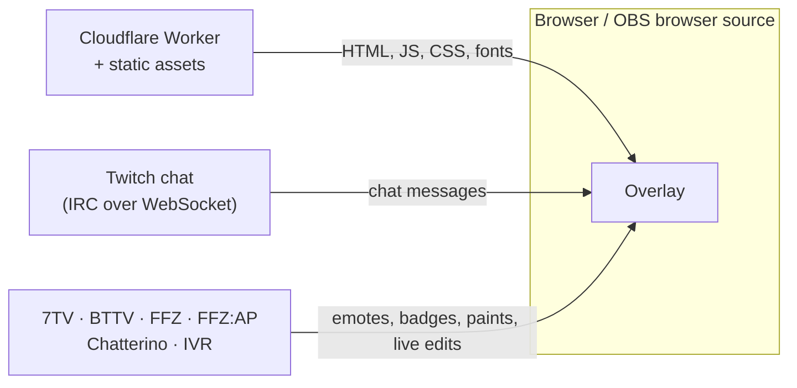

# Architecture

How Petal is built: what a running overlay talks to, how the code is organized, and the two
features around it that need a word of explanation, night mode and bot protection. For hosting and
costs, see [DEPLOYMENT.md](DEPLOYMENT.md). To work on the code, see [CONTRIBUTING.md](CONTRIBUTING.md).

## Names

The product is called Petal, and so is the repository. The Cloudflare Worker is still named
`chatbloom`, after the product's earlier name ChatBloom. The Worker name stays: renaming a Worker
creates a new one and drops its domains.

## How it works



The Worker only serves the app. It has no state, no secrets and no part in the chat traffic, apart
from turning crawlers and scripts away from chat pages. An open overlay costs one Worker request
when it loads and nothing while it runs. There is no server-side chat relay: each overlay opens
its own connections to Twitch and to the emote providers.

Everything a running overlay talks to:

| Service               | Hosts                                                                | Used for                                 |
| --------------------- | -------------------------------------------------------------------- | ---------------------------------------- |
| Twitch                | `irc-ws.chat.twitch.tv`, `static-cdn.jtvnw.net`                      | Chat, emote and badge images             |
| IVR                   | `api.ivr.fi`                                                         | Twitch badge sets                        |
| 7TV                   | `7tv.io`, `events.7tv.io`                                            | Emotes, paints, badges, live updates     |
| BetterTTV             | `api.betterttv.net`, `cdn.betterttv.net`, `sockets.betterttv.net`    | Emotes, badges, username effects         |
| FrankerFaceZ          | `api.frankerfacez.com`, `pubsub.workers.frankerfacez.com`            | Emotes, badges, live updates             |
| FFZ:AP, Chatterino    | `api.ffzap.com`, `api.chatterino.com`                                | Badges                                   |

Emote images also load from the CDNs those APIs point to.

### Inside the overlay

`src/lib/chat/session.ts` is the core. `createChatSession(channel)` opens the Twitch connection
and every provider socket, and exposes reactive state to the Solid components:

- `irc/` parses Twitch IRC (`parse.ts`) and runs the anonymous `justinfan` connection (`client.ts`).
- `providers/` has one module per service: REST loaders, and the live sockets for 7TV
  (EventAPI), BTTV and FFZ (pubsub).
- `tokenize.ts` turns a message into text, mention and emote parts, and `effects.ts` reduces
  emote modifiers to CSS.
- `socket.ts` is the shared `ReconnectingSocket` behind every connection: jittered exponential
  backoff after a drop. The Twitch and 7TV connections are also replaced when they go quiet.

Provider data arrives at any time, often after the user's first message, so messages are
re-derived when an emote set, badge or cosmetic changes instead of being frozen at arrival. The
overlay keeps the last 100 messages. `CLEARCHAT` and `CLEARMSG` remove messages from the screen.
A message from a Shared Chat session is drawn with the emotes and badges of the channel it came
from.

## Project layout

```text
src/
  routes/
    index.tsx               Start page: channel field, setup steps, features, questions
    v3/chat/[channel].tsx   The overlay
    imprint, impressum, privacy, datenschutz    Legal pages, English and German
  components/
    chat/                   Overlay: lines, emotes, usernames, name paints
    brand/                  Bloom mark, wordmark, sprinkles
    legal/                  Legal page layout and the operator's details
    seo/                    The start page's <head> and structured data
    start/                  Setup steps and questions on the start page
    ThemeToggle.tsx         Header button for light, dark or the device setting
  lib/
    channel.ts              Reads a channel from whatever people paste
    chat/                   Chat session, IRC, tokenizer, effects, providers
    seo/                    What Petal says about itself, and the files built from it
    theme/                  Night mode: shared rules and the controller around Dark Reader
  server/
    bots.ts, block-bots.ts  Bot check and the middleware that applies it to chat pages
    collapse-slashes.ts     Redirects paths with doubled slashes
    uncached-errors.ts      Keeps error responses out of caches
public/robots.txt           Only the start page may be indexed
public/llms.txt, llms-full.txt, sitemap.xml    Written by scripts/seo.ts
scripts/fontshare.ts        Downloads the Fontshare fonts before dev and build
scripts/seo.ts              Writes the files for search engines and language models
scripts/og.html             Source of public/og.png and og-square.png, the images of a shared link
scripts/og.ts               Renders them with a Chromium browser
test/                       Unit tests (Node's test runner)
docs/                       This documentation
```

| Layer      | Technology                                                                              |
| ---------- | --------------------------------------------------------------------------------------- |
| Framework  | [SolidStart](https://docs.solidjs.com/solid-start) 2 with Solid, Vite 8 and Nitro 3      |
| UI         | [SUID](https://suid.dev) (Material UI for Solid), patched for `@suid/styled-engine`      |
| Night mode | [Dark Reader](https://github.com/darkreader/darkreader), generated from the light styles |
| Language   | TypeScript 7                                                                            |
| Quality    | Biome for linting and formatting, `node --test` for tests                               |
| Hosting    | Cloudflare Workers with static assets, built and deployed by Cloudflare from this repo  |

## Night mode

The site is authored in white, and its night version is generated from the same tokens by
[Dark Reader](https://darkreader.org), never restyled by hand. Two layers work together:

- **Native.** `color-scheme` darkens scrollbars and form controls, and `theme-color` follows the
  page in the browser's address bar. A small script in `<head>` (`bootScript` in
  `src/lib/theme/mode.ts`) picks the theme before the first paint and holds the page back until
  Dark Reader has painted, so a dark visitor never sees a white flash.
- **Generated.** `src/lib/theme/controller.ts` loads Dark Reader as a browser-only chunk, so
  visitors in light mode never download it. It steps aside, and the toggle disappears, when the
  Dark Reader browser extension already themes the page. If the chunk fails to load, the page
  stays light instead of staying hidden.

The theme follows the device setting. The header toggle cycles between the device setting, light
and dark, and keeps the choice in the browser's local storage under `theme`, only after a visitor
uses the toggle. Without scripts the page stays light. Overlay paths (`/chat/` and `/v3/chat/`,
matched case-insensitively) are exempt: the overlay is transparent and always exactly as authored.

## Bot protection

Only the start page is meant for bots. A chat page shows the messages of a channel, so it is not
for crawlers or scripts.

- `public/robots.txt` allows the start page, the files it is made of and the files written for
  machines (see [SEO.md](SEO.md)), and disallows everything else.
- `src/server/block-bots.ts` runs for every request. On chat pages it sets
  `x-robots-tag: noindex, nofollow, noarchive` and answers `403` to a request without a
  `User-Agent`, or with one that names a crawler, an AI scraper, an HTTP library or a command-line
  tool (`src/server/bots.ts`). Paths are decoded and compared case-insensitively, the way the
  router reads them, so `/V3/CHAT/x` and `/v3/%63hat/x` are caught too.
- The check never issues a challenge: OBS cannot answer a challenge page, and a false positive
  would blank a streamer's overlay mid-stream. Browsers and browser-based streaming tools such as
  OBS pass.
- It goes by what a program says about itself, so a script that sends a browser's user agent gets
  through. The WAF rule and rate limit in
  [DEPLOYMENT.md](DEPLOYMENT.md#7-block-bots-on-the-chat-routes) cover that, and stop requests
  before a Worker request is billed.

## Security headers

Responses carry a security policy set in `vite.config.ts`: framing is refused by default, and
only the overlay pages stay embeddable, because streaming tools other than OBS load them in
frames. See [DEPLOYMENT.md](DEPLOYMENT.md#configuration) for the rules on changing it.
